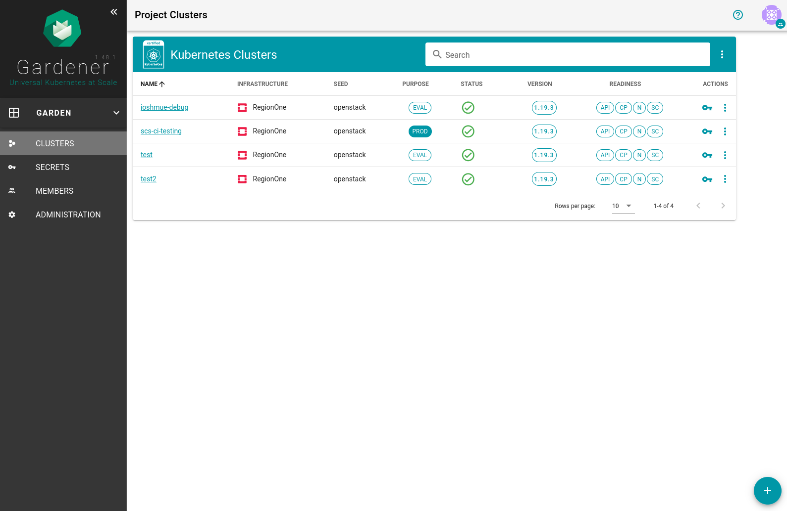
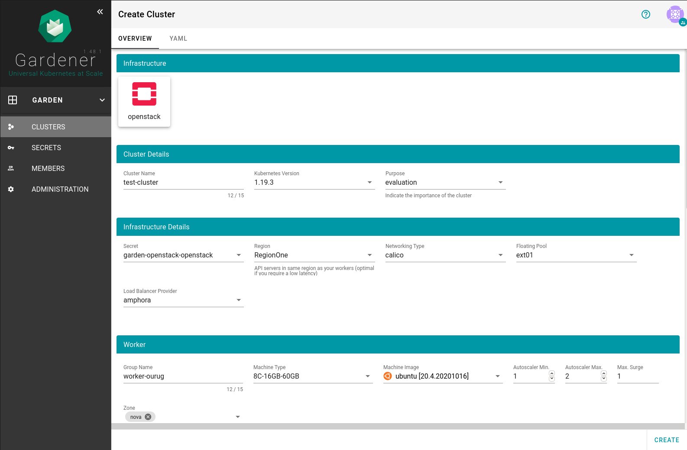
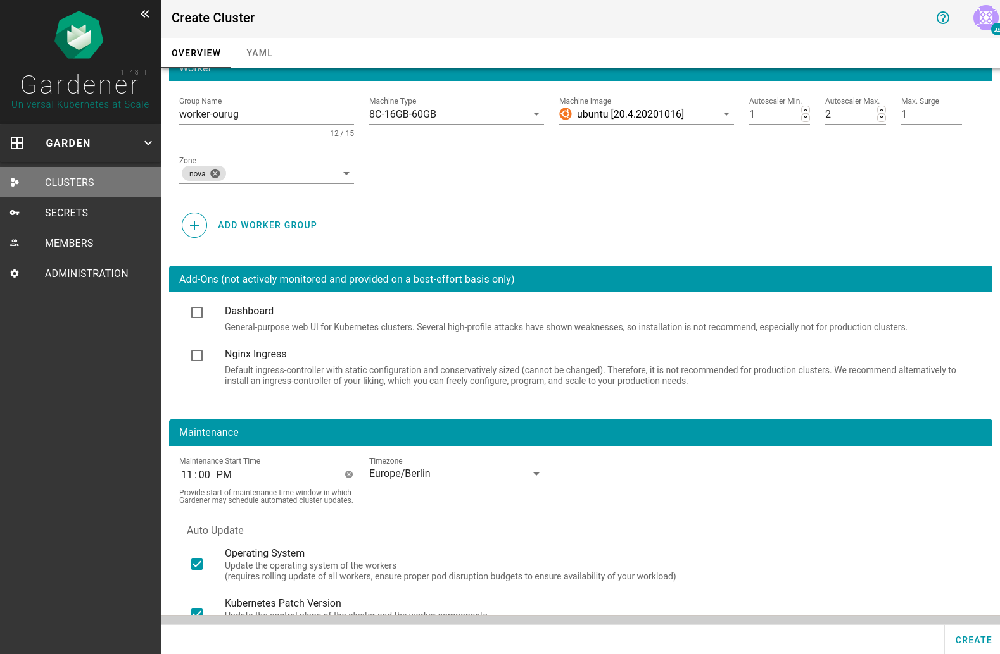
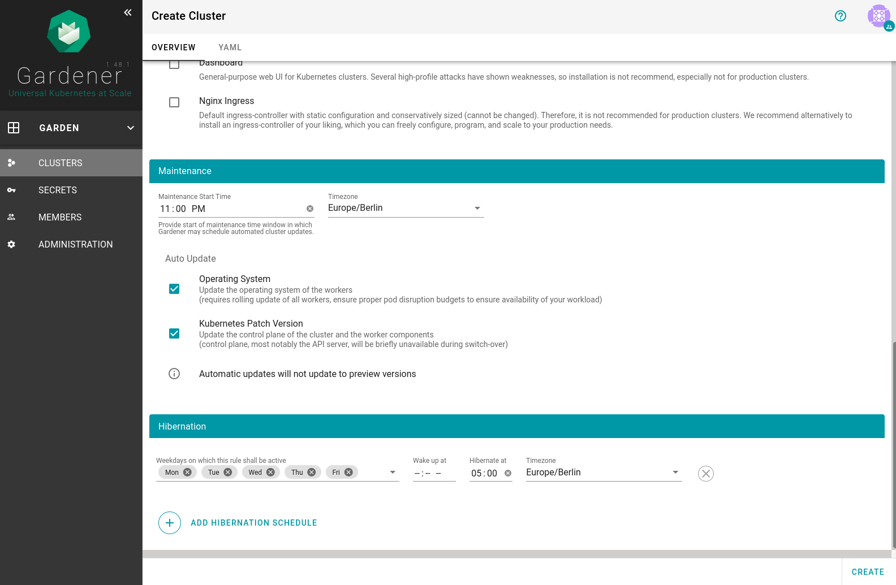
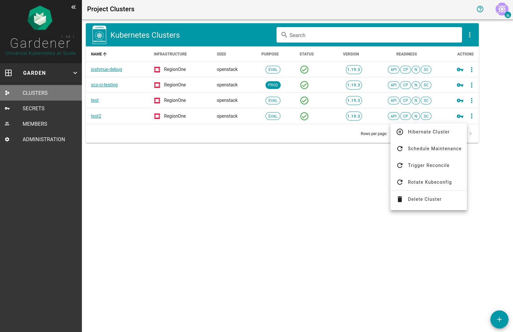
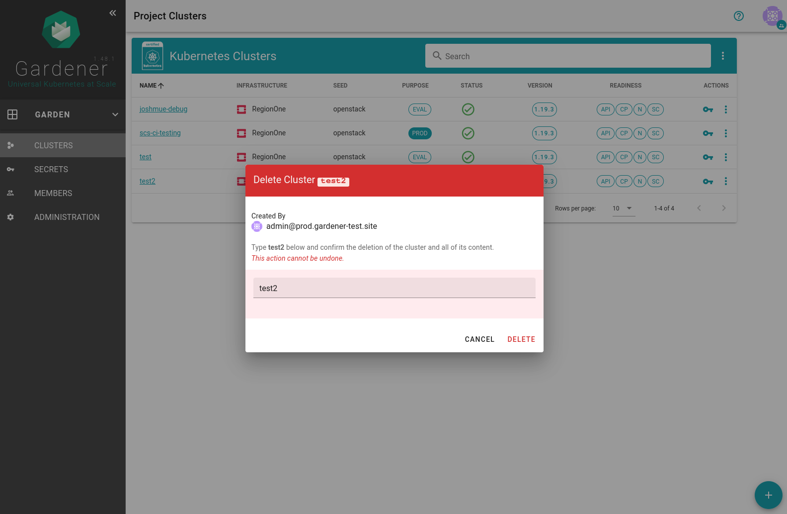

# Userguide
This is the userguide for the usage of the testbed. For admin-docs please refer to the main [readme](README.md) of the repo.
## How to get access
In case you deployed the testbed yourself you will get the respective credentials automatically at the end of a successful run. If you wish to access the productive testbed running on scs please contact me directly.
If you have managed to sign into the gardener dashboard, the following screen will greet you:

## How to create clusters
In order to create a new cluster press the big blue plus sign in the right hand bottom corner of the dashboard. You will be confronted with a screen to set your desired options for your cluster.
These include:
* Infrastructure
* Worker groups
* kubernetes version
* hibernation schedules
If you are done setting the desired values create the cluster by clicking the create button. Gardener will start to reconcile the current with your desired state. 

## How to accesss/use/test clusters
After the reconcilation process has finished you can access your kubeconfig bei clicking the key symbol on the right hand side of the cluster list

## How to clean up
In order to delete a cluster, click the menu button with the three dots, click delete and type in the cluster name to make sure you are deleting the right cluster.

