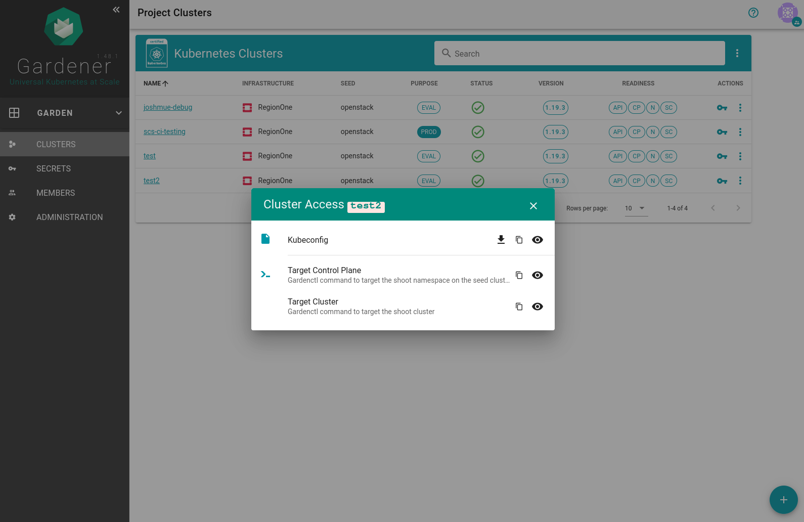

# Userguide
This is the userguide for the usage of the testbed. For admin-docs please refer to the main [readme](README.md) of the repo.
## How to get access
In case you deployed the testbed yourself you will get the respective credentials automatically at the end of a successful run. If you wish to access the productive testbed running on scs please contact me directly.
## How to create clusters
<> screenshotfoo

## How to accesss/use/test clusters
<> screenshotfoo
## How to clean up
<> screenshotfoo

